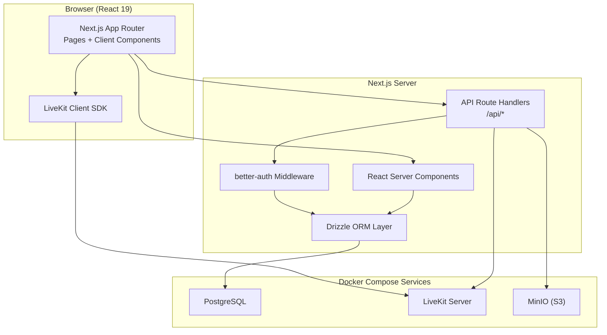
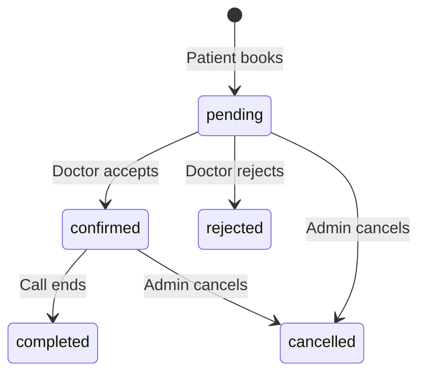

# Design Document: MediConnect Virtual Clinic Platform

## Overview

MediConnect is a full-stack virtual clinic MVP built on the existing Next.js 14 App Router project. It enables three user roles — Patient, Doctor, and Admin — to interact through appointment booking, live video consultations (WebRTC via LiveKit), prescription management (PDF via MinIO), and an analytics dashboard. Authentication uses better-auth with role-based access control. All data is persisted via Drizzle ORM to PostgreSQL, and infrastructure services run in Docker containers orchestrated by Docker Compose.

The design follows a layered architecture: Next.js App Router handles both the UI (React Server Components + Client Components) and API routes (Route Handlers). Drizzle ORM provides the type-safe data access layer. LiveKit provides WebRTC video infrastructure. MinIO provides S3-compatible object storage for prescription PDFs. Framer Motion powers UI animations, shadcn/ui provides the component library, and Recharts renders analytics charts.

## Architecture

### High-Level Architecture Diagram



### Request Flow

1. Browser loads pages via React Server Components (RSC) for initial data fetching
2. Client Components handle interactive UI (forms, video, animations)
3. Mutations go through Next.js API Route Handlers (`/api/*`)
4. better-auth middleware validates session tokens on protected routes
5. Drizzle ORM executes type-safe queries against PostgreSQL
6. LiveKit server manages WebRTC signaling and media relay
7. MinIO stores and serves prescription PDFs via pre-signed URLs

### Directory Structure

```
app/
├── (auth)/
│   ├── login/page.tsx
│   ├── register/page.tsx
│   └── layout.tsx
├── (dashboard)/
│   ├── layout.tsx                    # Authenticated layout with sidebar nav
│   ├── patient/
│   │   ├── appointments/page.tsx     # Patient appointment list
│   │   ├── book/[doctorId]/page.tsx  # Booking flow
│   │   ├── history/page.tsx          # Visit history
│   │   └── waiting-room/[appointmentId]/page.tsx
│   ├── doctor/
│   │   ├── appointments/page.tsx     # Doctor appointment management
│   │   ├── availability/page.tsx     # Availability calendar
│   │   └── prescriptions/[appointmentId]/page.tsx
│   ├── admin/
│   │   ├── users/page.tsx            # User management
│   │   ├── appointments/page.tsx     # Appointment oversight
│   │   └── analytics/page.tsx        # Analytics dashboard
│   └── consultation/[appointmentId]/page.tsx  # Video room
├── api/
│   ├── auth/[...all]/route.ts        # better-auth catch-all handler
│   ├── appointments/route.ts
│   ├── appointments/[id]/route.ts
│   ├── availability/route.ts
│   ├── availability/[id]/route.ts
│   ├── prescriptions/route.ts
│   ├── prescriptions/[id]/download/route.ts
│   ├── consultation/token/route.ts   # LiveKit token generation
│   ├── consultation/[id]/notes/route.ts
│   ├── admin/users/route.ts
│   ├── admin/appointments/route.ts
│   └── admin/analytics/route.ts
├── layout.tsx
├── page.tsx                          # Landing / redirect
└── globals.css
lib/
├── auth.ts                           # better-auth server config
├── auth-client.ts                    # better-auth client config
├── db/
│   ├── index.ts                      # Drizzle client instance
│   ├── schema.ts                     # All Drizzle table definitions
│   └── migrations/                   # Drizzle Kit migration files
├── livekit.ts                        # LiveKit server SDK helpers
├── minio.ts                          # MinIO client + helpers
├── pdf.ts                            # PDF generation utility
└── validators.ts                     # Zod schemas for API validation
components/
├── ui/                               # shadcn/ui components
├── auth/
│   ├── login-form.tsx
│   └── register-form.tsx
├── appointments/
│   ├── booking-stepper.tsx           # Framer Motion multi-step
│   ├── appointment-card.tsx
│   └── appointment-list.tsx
├── availability/
│   ├── calendar-view.tsx
│   └── slot-form.tsx
├── consultation/
│   ├── video-room.tsx                # LiveKit video component
│   ├── waiting-room.tsx              # Animated waiting UI
│   └── notes-panel.tsx               # In-call note editor
├── prescriptions/
│   ├── prescription-editor.tsx
│   └── prescription-viewer.tsx
├── admin/
│   ├── user-table.tsx
│   ├── analytics-charts.tsx
│   └── appointment-oversight.tsx
└── layout/
    ├── sidebar.tsx
    └── header.tsx
```

## Components and Interfaces

### 1. Authentication Module (`lib/auth.ts`, `lib/auth-client.ts`)

better-auth handles registration, login, session management, and role-based access.

```typescript
// lib/auth.ts — Server-side configuration
import { betterAuth } from "better-auth";
import { drizzleAdapter } from "better-auth/adapters/drizzle";
import { db } from "./db";

export const auth = betterAuth({
  database: drizzleAdapter(db, { provider: "pg" }),
  emailAndPassword: { enabled: true },
  session: { expiresIn: 60 * 60 * 24 * 7 }, // 7 days
});
```

Role enforcement is handled via a utility that reads the session and checks the user's role:

```typescript
// lib/auth-helpers.ts
export async function requireRole(role: "patient" | "doctor" | "admin") {
  const session = await auth.api.getSession({ headers: await headers() });
  if (!session || session.user.role !== role) {
    throw new Error("Unauthorized");
  }
  return session;
}
```

Next.js middleware (`middleware.ts`) protects dashboard routes by checking for a valid session cookie and redirecting unauthenticated users to `/login`.

### 2. Availability Calendar (`components/availability/calendar-view.tsx`)

A weekly calendar view for doctors to manage time slots. Uses shadcn/ui `Calendar` and `Dialog` components.

```typescript
interface AvailabilitySlot {
  id: string;
  doctorId: string;
  date: string;       // ISO date
  startTime: string;  // HH:mm
  endTime: string;    // HH:mm
}

// API: POST /api/availability — create slot
// API: DELETE /api/availability/[id] — delete slot (only if no booking)
// API: GET /api/availability?doctorId=X — list slots for a doctor
```

Overlap validation runs server-side: before inserting, query existing slots for the same doctor and date, then check for time range intersection.

### 3. Appointment Booking Flow (`components/appointments/booking-stepper.tsx`)

A multi-step animated form using Framer Motion `AnimatePresence` and `motion.div`:

- Step 1: Select doctor (list with search)
- Step 2: Select available slot (from doctor's availability)
- Step 3: Confirm booking

```typescript
// API: POST /api/appointments — create appointment
// Request body: { slotId: string, doctorId: string }
// Response: { appointment: Appointment }

interface CreateAppointmentRequest {
  slotId: string;
  doctorId: string;
}
```

Double-booking prevention: the API route wraps slot lookup + appointment creation in a database transaction. The slot's `isBooked` flag is checked and set atomically.

### 4. Appointment Management (`components/appointments/appointment-list.tsx`)

Doctor-facing list of pending appointments with accept/reject actions.

```typescript
// API: PATCH /api/appointments/[id]
// Request body: { action: "accept" | "reject" }
// On accept: status → "confirmed"
// On reject: status → "rejected", slot.isBooked → false
```

### 5. Video Consultation Room (`components/consultation/video-room.tsx`)

Uses `@livekit/components-react` for the video UI. Token generation happens server-side.

```typescript
// API: POST /api/consultation/token
// Request body: { appointmentId: string }
// Response: { token: string, serverUrl: string }

// Server-side token generation:
import { AccessToken } from "livekit-server-sdk";

function createRoomToken(roomName: string, participantName: string): string {
  const token = new AccessToken(apiKey, apiSecret, {
    identity: participantName,
  });
  token.addGrant({ roomJoin: true, room: roomName });
  return token.toJwt();
}
```

Room name is derived from the appointment ID to ensure session isolation. The "Join" button is enabled only when `appointment.status === "confirmed"` and the current time is within a window around the scheduled time.

### 6. Waiting Room (`components/consultation/waiting-room.tsx`)

Framer Motion animated interface showing queue position. Uses polling (or Server-Sent Events) to check:
- How many patients are waiting for the same doctor ahead of this patient
- Whether the doctor has started the session

```typescript
// API: GET /api/consultation/[appointmentId]/status
// Response: { queuePosition: number, doctorReady: boolean }
```

When `doctorReady` becomes `true`, a "Join Now" button appears with a Framer Motion entrance animation.

### 7. In-Call Notes Panel (`components/consultation/notes-panel.tsx`)

A side panel with a rich-text editor (using a lightweight editor like Tiptap or a simple `textarea` with markdown). Auto-saves every 15 seconds via debounced API call.

```typescript
// API: PUT /api/consultation/[appointmentId]/notes
// Request body: { content: string }
// Auto-save interval: 15 seconds (debounced)
```

### 8. Prescription Module (`components/prescriptions/prescription-editor.tsx`)

Rich-text editor with structured fields. On submit, the server generates a PDF and uploads to MinIO.

```typescript
interface PrescriptionData {
  appointmentId: string;
  medications: Array<{
    name: string;
    dosage: string;
    frequency: string;
    duration: string;
  }>;
  notes: string;
}

// API: POST /api/prescriptions — create prescription + generate PDF
// API: GET /api/prescriptions/[id]/download — get pre-signed MinIO URL
```

PDF generation uses a library like `@react-pdf/renderer` or `pdf-lib` to create the document server-side.

### 9. Admin Module

**User Management** (`components/admin/user-table.tsx`): Paginated, searchable table of all users. Activate/deactivate toggles.

```typescript
// API: GET /api/admin/users?search=X&role=Y&page=N
// API: PATCH /api/admin/users/[id] — { action: "activate" | "deactivate" }
```

**Appointment Oversight** (`components/admin/appointment-oversight.tsx`): Filterable list of all appointments. Cancel action available.

```typescript
// API: GET /api/admin/appointments?status=X&page=N
// API: PATCH /api/admin/appointments/[id] — { action: "cancel" }
```

**Analytics Dashboard** (`components/admin/analytics-charts.tsx`): Recharts-powered charts.

```typescript
// API: GET /api/admin/analytics?from=DATE&to=DATE
// Response: {
//   totalConsultations: number,
//   totalRevenue: number,
//   activeDoctors: number,
//   consultationTrend: Array<{ date: string, count: number }>,
// }
```

### 10. Notification Service (`lib/notifications.ts`)

Handles email sending (via a transactional email provider like Resend or Nodemailer with SMTP) and in-app notifications stored in the database.

```typescript
interface Notification {
  id: string;
  userId: string;
  type: "appointment_confirmed" | "appointment_rejected" | "appointment_cancelled" | "prescription_ready";
  message: string;
  read: boolean;
  createdAt: Date;
}

// sendEmail(to, subject, body) — sends transactional email
// createNotification(userId, type, message) — stores in-app notification
```

## Data Models

### Entity Relationship Diagram

```mermaid
erDiagram
    USER ||--o{ APPOINTMENT : "books (patient)"
    USER ||--o{ APPOINTMENT : "receives (doctor)"
    USER ||--o{ AVAILABILITY_SLOT : "creates"
    USER ||--o{ NOTIFICATION : "receives"
    APPOINTMENT ||--o| VISIT_NOTE : "has"
    APPOINTMENT ||--o| PRESCRIPTION : "has"
    AVAILABILITY_SLOT ||--o| APPOINTMENT : "booked by"

    USER {
        uuid id PK
        string name
        string email UK
        string role "patient | doctor | admin"
        boolean isActive "default true"
        timestamp createdAt
        timestamp updatedAt
    }

    AVAILABILITY_SLOT {
        uuid id PK
        uuid doctorId FK
        date date
        time startTime
        time endTime
        boolean isBooked "default false"
        timestamp createdAt
    }

    APPOINTMENT {
        uuid id PK
        uuid patientId FK
        uuid doctorId FK
        uuid slotId FK
        string status "pending | confirmed | rejected | completed | cancelled"
        timestamp scheduledAt
        timestamp createdAt
        timestamp updatedAt
    }

    VISIT_NOTE {
        uuid id PK
        uuid appointmentId FK UK
        text content
        timestamp createdAt
        timestamp updatedAt
    }

    PRESCRIPTION {
        uuid id PK
        uuid appointmentId FK UK
        jsonb medications
        text notes
        string pdfKey "MinIO object key"
        timestamp createdAt
    }

    NOTIFICATION {
        uuid id PK
        uuid userId FK
        string type
        string message
        boolean read "default false"
        timestamp createdAt
    }
```

### Drizzle ORM Schema Definitions

```typescript
// lib/db/schema.ts
import { pgTable, uuid, text, varchar, boolean, timestamp, date, time, jsonb, pgEnum } from "drizzle-orm/pg-core";

export const roleEnum = pgEnum("role", ["patient", "doctor", "admin"]);
export const appointmentStatusEnum = pgEnum("appointment_status", [
  "pending", "confirmed", "rejected", "completed", "cancelled"
]);

export const users = pgTable("users", {
  id: uuid("id").defaultRandom().primaryKey(),
  name: text("name").notNull(),
  email: varchar("email", { length: 255 }).notNull().unique(),
  emailVerified: boolean("email_verified").default(false),
  image: text("image"),
  role: roleEnum("role").notNull().default("patient"),
  isActive: boolean("is_active").notNull().default(true),
  createdAt: timestamp("created_at").defaultNow().notNull(),
  updatedAt: timestamp("updated_at").defaultNow().notNull(),
});

export const sessions = pgTable("sessions", {
  id: uuid("id").defaultRandom().primaryKey(),
  userId: uuid("user_id").notNull().references(() => users.id),
  token: text("token").notNull().unique(),
  expiresAt: timestamp("expires_at").notNull(),
  createdAt: timestamp("created_at").defaultNow().notNull(),
  updatedAt: timestamp("updated_at").defaultNow().notNull(),
});

export const accounts = pgTable("accounts", {
  id: uuid("id").defaultRandom().primaryKey(),
  userId: uuid("user_id").notNull().references(() => users.id),
  accountId: text("account_id").notNull(),
  providerId: text("provider_id").notNull(),
  accessToken: text("access_token"),
  refreshToken: text("refresh_token"),
  expiresAt: timestamp("expires_at"),
  createdAt: timestamp("created_at").defaultNow().notNull(),
  updatedAt: timestamp("updated_at").defaultNow().notNull(),
});

export const verifications = pgTable("verifications", {
  id: uuid("id").defaultRandom().primaryKey(),
  identifier: text("identifier").notNull(),
  value: text("value").notNull(),
  expiresAt: timestamp("expires_at").notNull(),
  createdAt: timestamp("created_at").defaultNow().notNull(),
  updatedAt: timestamp("updated_at").defaultNow().notNull(),
});

export const availabilitySlots = pgTable("availability_slots", {
  id: uuid("id").defaultRandom().primaryKey(),
  doctorId: uuid("doctor_id").notNull().references(() => users.id),
  date: date("date").notNull(),
  startTime: time("start_time").notNull(),
  endTime: time("end_time").notNull(),
  isBooked: boolean("is_booked").notNull().default(false),
  createdAt: timestamp("created_at").defaultNow().notNull(),
});

export const appointments = pgTable("appointments", {
  id: uuid("id").defaultRandom().primaryKey(),
  patientId: uuid("patient_id").notNull().references(() => users.id),
  doctorId: uuid("doctor_id").notNull().references(() => users.id),
  slotId: uuid("slot_id").notNull().references(() => availabilitySlots.id),
  status: appointmentStatusEnum("status").notNull().default("pending"),
  scheduledAt: timestamp("scheduled_at").notNull(),
  createdAt: timestamp("created_at").defaultNow().notNull(),
  updatedAt: timestamp("updated_at").defaultNow().notNull(),
});

export const visitNotes = pgTable("visit_notes", {
  id: uuid("id").defaultRandom().primaryKey(),
  appointmentId: uuid("appointment_id").notNull().references(() => appointments.id).unique(),
  content: text("content").notNull().default(""),
  createdAt: timestamp("created_at").defaultNow().notNull(),
  updatedAt: timestamp("updated_at").defaultNow().notNull(),
});

export const prescriptions = pgTable("prescriptions", {
  id: uuid("id").defaultRandom().primaryKey(),
  appointmentId: uuid("appointment_id").notNull().references(() => appointments.id).unique(),
  medications: jsonb("medications").notNull(),
  notes: text("notes"),
  pdfKey: varchar("pdf_key", { length: 512 }),
  createdAt: timestamp("created_at").defaultNow().notNull(),
});

export const notifications = pgTable("notifications", {
  id: uuid("id").defaultRandom().primaryKey(),
  userId: uuid("user_id").notNull().references(() => users.id),
  type: varchar("type", { length: 50 }).notNull(),
  message: text("message").notNull(),
  read: boolean("read").notNull().default(false),
  createdAt: timestamp("created_at").defaultNow().notNull(),
});
```

### Key Data Relationships

- **User → Availability Slots**: One doctor has many slots (1:N)
- **User → Appointments**: A patient books many appointments; a doctor receives many appointments (both 1:N)
- **Availability Slot → Appointment**: One slot can have at most one confirmed appointment (1:0..1)
- **Appointment → Visit Note**: One appointment has at most one visit note (1:0..1)
- **Appointment → Prescription**: One appointment has at most one prescription (1:0..1)
- **User → Notifications**: One user receives many notifications (1:N)

### Appointment Status State Machine




## Correctness Properties

*A property is a characteristic or behavior that should hold true across all valid executions of a system — essentially, a formal statement about what the system should do. Properties serve as the bridge between human-readable specifications and machine-verifiable correctness guarantees.*

### Property 1: Registration and login round-trip

*For any* valid email, password, and role (patient or doctor), registering a new user and then logging in with the same email and password should return a valid session containing the correct user ID and role.

**Validates: Requirements 1.1, 1.2**

### Property 2: Role-based access control enforcement

*For any* authenticated user with a given role and *for any* protected API route, the request should succeed if and only if the user's role is in the set of roles permitted for that route.

**Validates: Requirements 1.3**

### Property 3: Invalid credentials rejection

*For any* registered user and *for any* password that differs from the user's actual password, a login attempt should be rejected and return an error response.

**Validates: Requirements 1.4**

### Property 4: Unauthenticated access redirect

*For any* protected route and *for any* request without a valid session token, the system should respond with a redirect to the login page.

**Validates: Requirements 1.5**

### Property 5: Logout invalidates session

*For any* authenticated user, after logging out, the previously issued session token should no longer grant access to protected routes.

**Validates: Requirements 1.7**

### Property 6: Availability slot create/delete round-trip

*For any* doctor and *for any* valid future availability slot, creating the slot and then deleting it (when unbooked) should leave the doctor's slot list unchanged from its original state.

**Validates: Requirements 2.2, 2.3**

### Property 7: No overlapping or past availability slots

*For any* doctor and *for any* two availability slots on the same date whose time ranges overlap, the system should accept the first and reject the second. Additionally, *for any* slot with a date/time in the past, the system should reject creation.

**Validates: Requirements 2.4, 2.5**

### Property 8: Doctor sees own availability slots

*For any* doctor, querying availability slots should return only slots belonging to that doctor, and the returned set should be complete (no slots missing).

**Validates: Requirements 2.1**

### Property 9: Patient sees only unbooked slots

*For any* doctor with a mix of booked and unbooked availability slots, querying available slots for that doctor from the patient perspective should return only slots where `isBooked` is `false`.

**Validates: Requirements 3.1**

### Property 10: Booking creates pending appointment

*For any* patient and *for any* available (unbooked) slot, booking that slot should create an appointment record with status "pending", set the slot's `isBooked` to `true`, and associate the correct patient, doctor, and slot IDs.

**Validates: Requirements 3.2**

### Property 11: No double-booking

*For any* slot that already has a confirmed or pending appointment, attempting to book that slot for a different patient should be rejected, and the existing appointment should remain unchanged.

**Validates: Requirements 3.3, 3.6**

### Property 12: State-changing actions create notifications

*For any* action that changes appointment status (booking, accepting, rejecting, cancelling) or creates a prescription, the system should create a notification record for each affected user with the correct notification type.

**Validates: Requirements 3.4, 4.4, 8.4**

### Property 13: Appointment accept/reject state transitions

*For any* pending appointment, accepting it should change its status to "confirmed" and keep the slot booked. Rejecting it should change its status to "rejected" and set the slot's `isBooked` back to `false`.

**Validates: Requirements 4.2, 4.3**

### Property 14: Doctor pending appointments filter

*For any* doctor with a mix of pending, confirmed, and completed appointments, querying pending appointments should return only appointments with status "pending" that belong to that doctor.

**Validates: Requirements 4.1**

### Property 15: Join eligibility based on time window

*For any* appointment, the join eligibility function should return `true` if and only if the appointment status is "confirmed" and the current time is within a defined window (e.g., 5 minutes before to 30 minutes after) of the scheduled time.

**Validates: Requirements 5.1**

### Property 16: End call transitions to completed

*For any* appointment with status "confirmed" that has an active video session, ending the call should transition the appointment status to "completed".

**Validates: Requirements 5.4**

### Property 17: Unique room tokens per appointment

*For any* two distinct appointments, the generated LiveKit room names should be different, ensuring session isolation.

**Validates: Requirements 5.6**

### Property 18: Queue position ordering

*For any* set of N patients waiting for the same doctor, each patient's queue position should be a unique integer in the range [1, N], and the positions should be ordered by appointment scheduled time.

**Validates: Requirements 6.2**

### Property 19: Notes save/retrieve round-trip

*For any* appointment and *for any* note content string, saving the notes and then retrieving them should return content identical to what was saved.

**Validates: Requirements 7.2, 7.3**

### Property 20: Prescription submission persists data and generates PDF key

*For any* completed appointment and *for any* valid prescription data (with at least one medication containing name, dosage, frequency, and duration), submitting the prescription should persist a record in the database with all medication fields intact and a non-null `pdfKey`.

**Validates: Requirements 8.2, 8.3, 8.5**

### Property 21: Prescription PDF upload/download round-trip

*For any* prescription with a stored `pdfKey`, requesting a download should return a valid pre-signed URL, and fetching that URL should return a valid PDF file.

**Validates: Requirements 9.3, 14.2, 14.3**

### Property 22: Patient visit history returns only completed appointments

*For any* patient with appointments in various statuses, the visit history API should return only appointments with status "completed" belonging to that patient.

**Validates: Requirements 9.1**

### Property 23: Appointment detail retrieval includes notes and prescription

*For any* completed appointment that has associated visit notes and a prescription, retrieving the appointment details should include both the note content and the prescription data.

**Validates: Requirements 9.2, 11.2**

### Property 24: Admin user search filtering

*For any* search query string and role filter, the admin user list API should return only users whose name or email contains the search string and whose role matches the filter.

**Validates: Requirements 10.2**

### Property 25: User activate/deactivate round-trip

*For any* active user, deactivating them should prevent login (return auth error), and subsequently reactivating them should restore login capability.

**Validates: Requirements 10.3, 10.4**

### Property 26: Admin appointment status filtering

*For any* status filter value, the admin appointments API should return only appointments matching that status, and the count should equal the number of appointments with that status in the database.

**Validates: Requirements 11.1**

### Property 27: Admin cancel appointment transitions state and notifies

*For any* appointment with status "pending" or "confirmed", an admin cancel action should change the status to "cancelled" and create notification records for both the patient and the doctor.

**Validates: Requirements 11.3**

### Property 28: Analytics aggregation correctness

*For any* set of appointments and users in the database, the analytics API should return: a `totalConsultations` count equal to the number of "completed" appointments, a `totalRevenue` equal to the sum of fees for completed appointments, and an `activeDoctors` count equal to the number of users with role "doctor" and `isActive` true.

**Validates: Requirements 12.1, 12.2, 12.3**

### Property 29: Analytics date range filtering

*For any* date range [start, end] and *for any* set of appointments, the analytics API filtered by that range should include only appointments whose `scheduledAt` falls within [start, end], and all aggregate metrics should reflect only those filtered appointments.

**Validates: Requirements 12.5**


## Error Handling

### Authentication Errors

| Scenario | HTTP Status | Response | Action |
|----------|-------------|----------|--------|
| Invalid credentials | 401 | `{ error: "Invalid email or password" }` | Display error in login form |
| Expired session | 401 | `{ error: "Session expired" }` | Redirect to login page |
| Insufficient role | 403 | `{ error: "Forbidden" }` | Redirect to role-appropriate dashboard |
| Deactivated account | 403 | `{ error: "Account deactivated" }` | Display deactivation message |

### Appointment Errors

| Scenario | HTTP Status | Response | Action |
|----------|-------------|----------|--------|
| Slot already booked | 409 | `{ error: "Slot no longer available" }` | Refresh available slots, show message |
| Slot in the past | 400 | `{ error: "Cannot book a past time slot" }` | Highlight validation error |
| Overlapping slot | 409 | `{ error: "Overlapping slot exists" }` | Show conflict details |
| Invalid state transition | 400 | `{ error: "Cannot transition from {current} to {target}" }` | Refresh appointment status |
| Appointment not found | 404 | `{ error: "Appointment not found" }` | Redirect to appointment list |

### Video Consultation Errors

| Scenario | HTTP Status | Response | Action |
|----------|-------------|----------|--------|
| Not within join window | 403 | `{ error: "Consultation not yet available" }` | Show countdown timer |
| LiveKit token generation failure | 500 | `{ error: "Unable to create video session" }` | Retry button with exponential backoff |
| Network disconnection | N/A (client) | Reconnection attempt | Auto-reconnect for 30s, then show disconnect notice |

### File Storage Errors

| Scenario | HTTP Status | Response | Action |
|----------|-------------|----------|--------|
| MinIO unavailable | 503 | `{ error: "File storage temporarily unavailable" }` | Show retry option |
| PDF generation failure | 500 | `{ error: "Failed to generate prescription PDF" }` | Save prescription data to DB, retry PDF later |
| Pre-signed URL expired | 403 | `{ error: "Download link expired" }` | Generate new pre-signed URL |

### Validation Errors

All API routes validate input using Zod schemas. Invalid requests return:

```json
{
  "error": "Validation failed",
  "details": [
    { "field": "email", "message": "Invalid email format" },
    { "field": "startTime", "message": "Start time must be before end time" }
  ]
}
```

HTTP Status: 400 for all validation errors.

### Global Error Handling Strategy

- API Route Handlers wrap logic in try/catch blocks and return structured JSON error responses
- Client-side errors are caught by React Error Boundaries at the layout level
- Database connection errors trigger a 503 response with a retry-after header
- All errors are logged server-side with request context (user ID, route, timestamp)
- Sensitive information (stack traces, internal IDs) is never exposed in error responses

## Testing Strategy

### Testing Framework

- **Unit & Integration Tests**: Vitest (fast, TypeScript-native, compatible with Next.js)
- **Property-Based Tests**: fast-check (JavaScript/TypeScript PBT library, integrates with Vitest)
- **Component Tests**: React Testing Library with Vitest
- **E2E Tests** (optional, out of MVP scope): Playwright

### Dual Testing Approach

Both unit tests and property-based tests are required for comprehensive coverage:

- **Unit tests** verify specific examples, edge cases, and integration points
- **Property-based tests** verify universal properties across randomly generated inputs
- Together they provide both concrete bug detection and general correctness guarantees

### Property-Based Testing Configuration

- Library: `fast-check` (npm package)
- Each property test runs a minimum of **100 iterations**
- Each property test is tagged with a comment referencing the design property:
  ```
  // Feature: mediconnect-virtual-clinic, Property {N}: {property title}
  ```
- Each correctness property is implemented by a **single** property-based test
- Generators produce random valid instances of: users (with roles), availability slots (with valid time ranges), appointments (with valid state), prescription data (with medication arrays), date ranges, search queries

### Test Organization

```
__tests__/
├── unit/
│   ├── auth.test.ts              # Login, registration, session examples
│   ├── availability.test.ts      # Slot CRUD, overlap detection examples
│   ├── appointments.test.ts      # Booking, state transitions examples
│   ├── prescriptions.test.ts     # Prescription creation, PDF examples
│   ├── analytics.test.ts         # Aggregation computation examples
│   └── notifications.test.ts     # Notification creation examples
├── properties/
│   ├── auth.property.test.ts     # Properties 1-5
│   ├── availability.property.test.ts  # Properties 6-9
│   ├── appointments.property.test.ts  # Properties 10-16, 26-27
│   ├── consultation.property.test.ts  # Properties 17-19
│   ├── prescriptions.property.test.ts # Properties 20-21
│   ├── patient.property.test.ts  # Properties 22-23
│   ├── admin.property.test.ts    # Properties 24-25, 28-29
│   └── waiting-room.property.test.ts  # Property 18
└── integration/
    ├── booking-flow.test.ts      # End-to-end booking flow
    ├── consultation-flow.test.ts # Video consultation lifecycle
    └── prescription-flow.test.ts # Prescription creation + download
```

### Unit Test Focus Areas

- Specific examples of valid/invalid registration data
- Edge cases: empty strings, boundary times (midnight), maximum-length inputs
- Error conditions: MinIO unavailable, invalid state transitions
- Integration points: auth middleware + route handlers, Drizzle queries + PostgreSQL

### Property Test to Design Property Mapping

| Test File | Properties Covered |
|-----------|-------------------|
| `auth.property.test.ts` | P1 (registration round-trip), P2 (RBAC), P3 (invalid creds), P4 (unauth redirect), P5 (logout) |
| `availability.property.test.ts` | P6 (slot CRUD round-trip), P7 (overlap/past validation), P8 (doctor's slots), P9 (unbooked filter) |
| `appointments.property.test.ts` | P10 (booking creates pending), P11 (no double-booking), P12 (notifications), P13 (accept/reject), P14 (pending filter), P15 (join eligibility), P16 (end call → completed), P26 (admin status filter), P27 (admin cancel) |
| `consultation.property.test.ts` | P17 (unique tokens), P19 (notes round-trip) |
| `waiting-room.property.test.ts` | P18 (queue ordering) |
| `prescriptions.property.test.ts` | P20 (prescription persistence), P21 (PDF round-trip) |
| `patient.property.test.ts` | P22 (visit history filter), P23 (detail retrieval) |
| `admin.property.test.ts` | P24 (user search), P25 (activate/deactivate round-trip), P28 (analytics aggregation), P29 (date range filter) |
