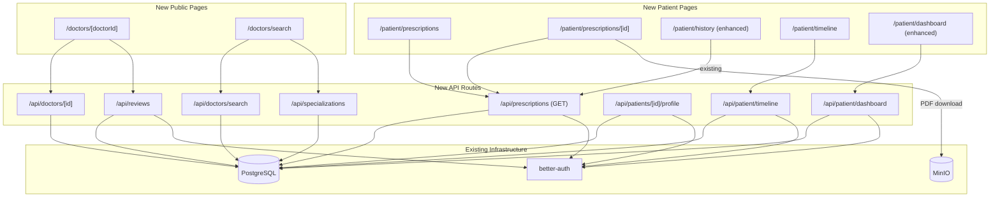
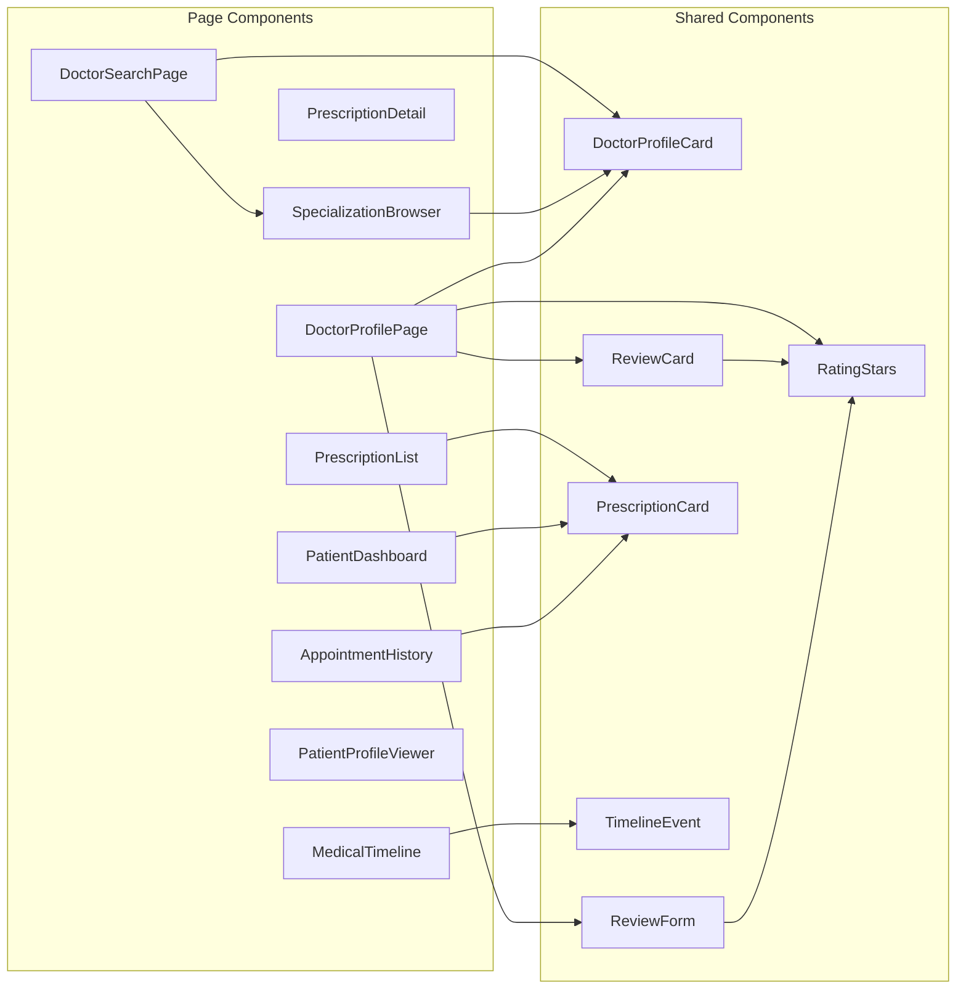
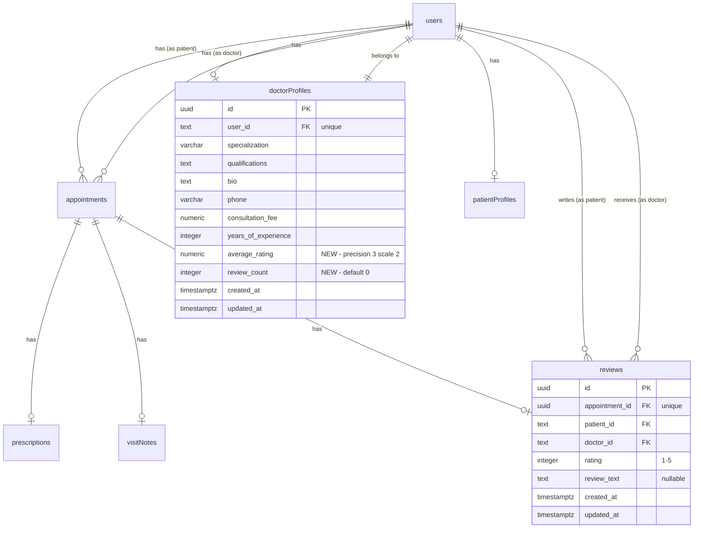

# Design Document: Patient & Doctor Experience Enhancements

## Overview

This design extends the MediConnect Virtual Clinic with features that improve the patient and doctor experience across six areas: prescription history browsing, pre-appointment patient profiles, enhanced doctor profiles with reviews, doctor search and filtering, specialization browsing, and dashboard/timeline improvements.

The design builds on existing infrastructure:
- `prescriptions` table and PDF generation/download pipeline already exist
- `doctorProfiles` and `patientProfiles` tables store extended profile data
- `visit-history` component shows completed appointments with prescription details
- `booking-stepper` component handles the doctor selection and appointment booking flow
- `DoctorProfileCard` component renders doctor summary cards
- API routes follow Next.js App Router conventions with Zod validation and `getSession`/`requireRole` auth helpers

Key design decisions:
1. **Denormalized review aggregates**: `averageRating` and `reviewCount` are cached on `doctorProfiles` and updated transactionally when reviews are submitted, avoiding expensive aggregation queries on every doctor list/search request.
2. **Reuse existing components**: The `DoctorProfileCard` is extended with an optional `averageRating` prop rather than creating a new component. The existing `visit-history` patterns inform the new prescription history and appointment history pages.
3. **Single search endpoint**: `/api/doctors/search` handles text search, specialization filtering, and pagination in one endpoint, keeping the API surface small.
4. **Client-side timeline assembly**: The medical timeline aggregates appointments, prescriptions, and visit notes on the server via a single API call, returning a unified event list to the client.

## Architecture



### Component Relationship Diagram



## Components and Interfaces

### New Pages

#### 1. Patient Prescription History Page
- **Path**: `app/(dashboard)/patient/prescriptions/page.tsx`
- **Auth**: Patient role required
- **Behavior**: Fetches `GET /api/prescriptions?patientId=me` and renders a list of `PrescriptionCard` components ordered by creation date descending. Empty state when no prescriptions exist.

#### 2. Prescription Detail View
- **Path**: `app/(dashboard)/patient/prescriptions/[id]/page.tsx`
- **Auth**: Patient role required (must own the prescription's appointment)
- **Behavior**: Fetches prescription by ID, displays medications table, doctor notes, summary header with doctor name/date, and conditional PDF download button.

#### 3. Doctor Profile Page (Public)
- **Path**: `app/doctors/[doctorId]/page.tsx`
- **Auth**: None required for basic info; authenticated patients see "Book Appointment" button
- **Behavior**: Fetches `GET /api/doctors/[id]` for profile data and `GET /api/reviews?doctorId=[id]` for reviews. Displays full profile, average rating, review list, and booking CTA.

#### 4. Doctor Search Page
- **Path**: `app/doctors/search/page.tsx`
- **Auth**: None required
- **Behavior**: Text search input (debounced 500ms, min 2 chars), specialization filter chips from `/api/specializations`, results as `DoctorProfileCard` grid. Clicking a card navigates to `/doctors/[doctorId]`.

#### 5. Enhanced Appointment History
- **Path**: `app/(dashboard)/patient/history/page.tsx` (enhanced existing)
- **Auth**: Patient role required
- **Behavior**: Extends existing `VisitHistory` to show all past statuses (completed, cancelled, rejected), adds status filter tabs, expandable detail view with visit notes and prescription links.

#### 6. Patient Dashboard
- **Path**: `app/(dashboard)/patient/page.tsx` (new or enhanced)
- **Auth**: Patient role required
- **Behavior**: Summary cards (upcoming count, completed count, prescription count), next appointment card, 3 most recent prescriptions, "Quick Book" link.

#### 7. Medical Records Timeline
- **Path**: `app/(dashboard)/patient/timeline/page.tsx`
- **Auth**: Patient role required
- **Behavior**: Fetches `GET /api/patient/timeline` returning unified event list. Renders `TimelineEvent` components with type icons, date, summary. Filter toggles for event types.

#### 8. Patient Profile Viewer (for Doctors)
- **Path**: Rendered as a dialog/sheet from the doctor's appointments page
- **Auth**: Doctor role required, must be assigned to the appointment
- **Behavior**: Fetches `GET /api/patients/[id]/profile?appointmentId=[apptId]`, displays read-only patient medical profile. Shows incomplete notice if profile is missing.

### New Components

#### PrescriptionCard
```typescript
interface PrescriptionCardProps {
  id: string;
  doctorName: string;
  appointmentDate: string;
  medicationCount: number;
  createdAt: string;
  onClick?: () => void;
}
```

#### RatingStars
```typescript
interface RatingStarsProps {
  rating: number;          // 0-5, supports half stars via rounding
  maxRating?: number;      // default 5
  interactive?: boolean;   // if true, allows clicking to set rating
  onRate?: (rating: number) => void;
  size?: "sm" | "md" | "lg";
}
```

#### ReviewCard
```typescript
interface ReviewCardProps {
  reviewerName: string;    // or "Anonymous"
  rating: number;
  reviewText: string | null;
  createdAt: string;
}
```

#### ReviewForm
```typescript
interface ReviewFormProps {
  appointmentId: string;
  doctorId: string;
  onSubmitted: () => void;
}
```

#### TimelineEvent
```typescript
interface TimelineEventProps {
  type: "appointment" | "prescription" | "visit_note";
  date: string;
  summary: string;
  detailUrl: string;
  icon: React.ReactNode;
}
```

#### PatientProfileViewer
```typescript
interface PatientProfileViewerProps {
  patientId: string;
  appointmentId: string;
  open: boolean;
  onClose: () => void;
}
```

#### SpecializationBrowser
```typescript
interface SpecializationBrowserProps {
  onSelectSpecialization: (specialization: string) => void;
  selectedSpecialization: string | null;
}
```

### New API Routes

#### GET `/api/prescriptions`
- **Auth**: Patient (own prescriptions) or Doctor/Admin
- **Query params**: none (uses session to determine patient)
- **Response**: `PrescriptionListItem[]`
```typescript
interface PrescriptionListItem {
  id: string;
  appointmentId: string;
  doctorName: string;
  appointmentDate: string;
  medications: Medication[];
  notes: string | null;
  pdfKey: string | null;
  createdAt: string;
}
```

#### GET `/api/doctors/[id]`
- **Auth**: None required
- **Response**: `DoctorProfileDetail`
```typescript
interface DoctorProfileDetail {
  id: string;
  name: string;
  photoUrl: string | null;
  specialization: string | null;
  qualifications: string | null;
  bio: string | null;
  yearsOfExperience: number | null;
  consultationFee: string | null;
  averageRating: number | null;
  reviewCount: number;
  profileComplete: boolean;
}
```

#### GET `/api/doctors/search`
- **Auth**: None required
- **Query params**: `q` (search text), `specialization` (exact match filter), `page` (default 1), `limit` (default 12)
- **Response**:
```typescript
interface DoctorSearchResponse {
  doctors: DoctorSearchResult[];
  total: number;
  page: number;
  limit: number;
}

interface DoctorSearchResult {
  id: string;
  name: string;
  photoUrl: string | null;
  specialization: string | null;
  qualifications: string | null;
  yearsOfExperience: number | null;
  consultationFee: string | null;
  averageRating: number | null;
  reviewCount: number;
}
```

#### GET `/api/specializations`
- **Auth**: None required
- **Response**: `SpecializationItem[]`
```typescript
interface SpecializationItem {
  specialization: string;
  doctorCount: number;
}
```

#### POST `/api/reviews`
- **Auth**: Patient role required
- **Body**:
```typescript
interface CreateReviewBody {
  appointmentId: string;
  doctorId: string;
  rating: number;       // 1-5 integer
  reviewText?: string;  // optional, max 2000 chars
}
```
- **Response**: Created review object (201)

#### GET `/api/reviews`
- **Auth**: None required
- **Query params**: `doctorId` (required)
- **Response**: `ReviewItem[]`
```typescript
interface ReviewItem {
  id: string;
  rating: number;
  reviewText: string | null;
  reviewerName: string;
  createdAt: string;
}
```

#### GET `/api/patients/[id]/profile`
- **Auth**: Doctor assigned to appointment, or Admin
- **Query params**: `appointmentId` (required, used for authorization check)
- **Response**: `PatientProfileData`
```typescript
interface PatientProfileData {
  name: string;
  dateOfBirth: string | null;
  gender: string | null;
  bloodType: string | null;
  allergies: string | null;
  emergencyContactName: string | null;
  emergencyContactPhone: string | null;
  medicalHistoryNotes: string | null;
  profileComplete: boolean;
}
```

#### GET `/api/patient/timeline`
- **Auth**: Patient role required
- **Query params**: `type` (optional filter: "appointment" | "prescription" | "visit_note")
- **Response**: `TimelineEventData[]`
```typescript
interface TimelineEventData {
  id: string;
  type: "appointment" | "prescription" | "visit_note";
  date: string;
  summary: string;
  detailUrl: string;
}
```

#### GET `/api/patient/dashboard`
- **Auth**: Patient role required
- **Response**:
```typescript
interface PatientDashboardData {
  upcomingCount: number;
  completedCount: number;
  prescriptionCount: number;
  nextAppointment: {
    id: string;
    doctorName: string;
    date: string;
    startTime: string;
    endTime: string;
    status: string;
  } | null;
  recentPrescriptions: PrescriptionListItem[];
}
```

### New Zod Validation Schemas

```typescript
// In lib/validators.ts

export const createReviewSchema = z.object({
  appointmentId: z.string().uuid(),
  doctorId: z.string().min(1),
  rating: z.number().int().min(1).max(5),
  reviewText: z.string().max(2000).optional(),
});

export const doctorSearchSchema = z.object({
  q: z.string().min(2).max(100).optional(),
  specialization: z.string().max(255).optional(),
  page: z.coerce.number().int().min(1).default(1),
  limit: z.coerce.number().int().min(1).max(50).default(12),
});

export const timelineFilterSchema = z.object({
  type: z.enum(["appointment", "prescription", "visit_note"]).optional(),
});

export const reviewsQuerySchema = z.object({
  doctorId: z.string().min(1),
});
```

## Data Models

### New Table: `reviews`

```typescript
export const reviews = pgTable("reviews", {
  id: uuid("id").defaultRandom().primaryKey(),
  appointmentId: uuid("appointment_id")
    .notNull()
    .references(() => appointments.id)
    .unique(),  // one review per appointment
  patientId: text("patient_id")
    .notNull()
    .references(() => users.id),
  doctorId: text("doctor_id")
    .notNull()
    .references(() => users.id),
  rating: integer("rating").notNull(),  // 1-5
  reviewText: text("review_text"),
  createdAt: timestamp("created_at", { withTimezone: true }).defaultNow().notNull(),
  updatedAt: timestamp("updated_at", { withTimezone: true }).defaultNow().notNull(),
});
```

### Modified Table: `doctorProfiles`

Add two new columns:

```typescript
// Added to existing doctorProfiles definition
averageRating: numeric("average_rating", { precision: 3, scale: 2 }),
reviewCount: integer("review_count").notNull().default(0),
```

### Entity Relationship Diagram



### Review Submission Transaction Flow

When a review is submitted, the following operations occur within a single database transaction:

1. Validate the appointment exists, is completed, belongs to the patient, and has no existing review
2. Insert the review record
3. Recalculate `averageRating` = `AVG(rating)` from all reviews for the doctor
4. Update `reviewCount` = `COUNT(*)` from all reviews for the doctor
5. Update `doctorProfiles` with new `averageRating` and `reviewCount`

```typescript
// Pseudocode for the transaction
await db.transaction(async (tx) => {
  const [review] = await tx.insert(reviews).values({ ... }).returning();
  
  const [agg] = await tx
    .select({
      avg: sql<number>`AVG(${reviews.rating})`,
      count: sql<number>`COUNT(*)`,
    })
    .from(reviews)
    .where(eq(reviews.doctorId, doctorId));
  
  await tx
    .update(doctorProfiles)
    .set({
      averageRating: agg.avg.toFixed(2),
      reviewCount: agg.count,
    })
    .where(eq(doctorProfiles.userId, doctorId));
});
```


## Correctness Properties

*A property is a characteristic or behavior that should hold true across all valid executions of a system — essentially, a formal statement about what the system should do. Properties serve as the bridge between human-readable specifications and machine-verifiable correctness guarantees.*

### Property 1: Prescription list ordering invariant

*For any* patient with N prescriptions (N ≥ 0), the list returned by `GET /api/prescriptions` SHALL be ordered by `createdAt` descending — that is, for every consecutive pair of items at indices i and i+1, `items[i].createdAt >= items[i+1].createdAt`.

**Validates: Requirements 1.1**

### Property 2: Prescription list item contains required fields

*For any* prescription record with associated appointment and doctor, the list item returned by the prescriptions API SHALL include non-null values for `doctorName`, `appointmentDate`, `medications` (with length ≥ 1), and `createdAt`.

**Validates: Requirements 1.2, 2.4**

### Property 3: Patient role authorization gate

*For any* user whose role is not "patient", attempting to access patient-only endpoints (`/api/prescriptions` as patient, `/api/patient/timeline`, `/api/patient/dashboard`) SHALL return a 403 or redirect. Conversely, *for any* authenticated user with role "patient", access SHALL be granted.

**Validates: Requirements 1.5**

### Property 4: Medication table data completeness

*For any* prescription with a list of medications, each medication in the detail response SHALL contain non-empty `name`, `dosage`, `frequency`, and `duration` fields, and the count of medications in the response SHALL equal the count stored in the database.

**Validates: Requirements 2.1, 2.2**

### Property 5: Patient profile viewer authorization

*For any* appointment and any requesting user, the patient profile endpoint SHALL return profile data if and only if the user is the doctor assigned to that appointment OR the user has the "admin" role. All other users SHALL receive a 403 Forbidden response.

**Validates: Requirements 3.4, 3.5**

### Property 6: Patient profile data completeness

*For any* patient with a completed profile, the patient profile viewer response SHALL include all of: `name`, `dateOfBirth`, `gender`, `bloodType`, `allergies`, `emergencyContactName`, `emergencyContactPhone`, and `medicalHistoryNotes`. The `profileComplete` field SHALL be `true` if and only if the patient has a `patientProfiles` record.

**Validates: Requirements 3.2**

### Property 7: Doctor profile contains required fields

*For any* doctor with a completed profile, the `GET /api/doctors/[id]` response SHALL include non-null values for `name`, `specialization`, `qualifications`, `yearsOfExperience`, `consultationFee`, and SHALL include `averageRating` and `reviewCount` fields (which may be null/0 if no reviews exist).

**Validates: Requirements 4.1, 4.2**

### Property 8: Review list data completeness

*For any* review associated with a doctor, the review item returned by `GET /api/reviews?doctorId=X` SHALL include `rating` (integer 1-5), `reviewerName` (non-empty string), `reviewText` (string or null), and `createdAt` (valid timestamp).

**Validates: Requirements 4.3**

### Property 9: Doctor search text matching

*For any* set of active doctors with completed profiles and any search query string `q` (length ≥ 2), every doctor in the search results SHALL have `q` as a case-insensitive substring of either their `name` or their `specialization`.

**Validates: Requirements 5.1, 11.2**

### Property 10: Doctor search specialization filter

*For any* set of doctors and any specialization filter value, every doctor in the filtered results SHALL have a `specialization` field that exactly matches the filter value. When combined with a text search, both conditions SHALL hold simultaneously.

**Validates: Requirements 5.5, 6.2, 11.3**

### Property 11: Doctor search pagination invariant

*For any* set of N matching doctors, requesting page P with limit L SHALL return at most L results, the `total` field SHALL equal N, and the union of all pages SHALL equal the complete result set with no duplicates.

**Validates: Requirements 11.4, 11.6**

### Property 12: Search result fields completeness

*For any* doctor search result, the response object SHALL include all of: `id`, `name`, `photoUrl`, `specialization`, `qualifications`, `yearsOfExperience`, `consultationFee`, `averageRating`, and `reviewCount`.

**Validates: Requirements 5.3, 11.5**

### Property 13: Specializations derived from data with correct counts

*For any* set of doctor profiles in the database, the `GET /api/specializations` endpoint SHALL return exactly the set of distinct non-null specializations present in active doctor profiles, each with a `doctorCount` equal to the number of active doctors with that specialization, ordered alphabetically.

**Validates: Requirements 6.3, 6.5, 13.1, 13.2, 13.3**

### Property 14: Appointment history ordering and status filtering

*For any* patient with past appointments, the appointment history SHALL return only appointments with status in {completed, cancelled, rejected}, ordered by `scheduledAt` descending. When a status filter is applied, every returned appointment SHALL have that exact status.

**Validates: Requirements 7.1, 7.4**

### Property 15: Appointment history entry completeness

*For any* past appointment, the history entry SHALL include `doctorName`, `date`, `startTime`, `endTime`, `status`, and boolean indicators `hasVisitNotes` and `hasPrescription`.

**Validates: Requirements 7.2**

### Property 16: Dashboard aggregate counts correctness

*For any* patient with a set of appointments and prescriptions, the dashboard SHALL return `upcomingCount` equal to the count of appointments with status "pending" or "confirmed" and `scheduledAt` in the future, `completedCount` equal to the count of appointments with status "completed", and `prescriptionCount` equal to the total number of prescriptions for the patient's appointments.

**Validates: Requirements 8.1**

### Property 17: Dashboard next appointment selection

*For any* patient with upcoming appointments, the `nextAppointment` field SHALL be the appointment with the earliest `scheduledAt` among those with status "pending" or "confirmed" and `scheduledAt` in the future. If no upcoming appointments exist, `nextAppointment` SHALL be null.

**Validates: Requirements 8.2**

### Property 18: Dashboard recent prescriptions

*For any* patient with N prescriptions, the `recentPrescriptions` array SHALL contain min(N, 3) items, ordered by `createdAt` descending, and each item SHALL be a valid prescription belonging to the patient.

**Validates: Requirements 8.3**

### Property 19: Review submission round-trip

*For any* valid review (rating 1-5, optional text ≤ 2000 chars) submitted for a completed appointment, retrieving the review by doctor ID SHALL return a record with the same `rating`, `reviewText`, `patientId`, `doctorId`, and `appointmentId`.

**Validates: Requirements 9.1, 9.3**

### Property 20: One review per appointment uniqueness

*For any* appointment that already has a review, attempting to submit a second review for that appointment SHALL be rejected with an error. The total number of reviews for a doctor SHALL equal the number of distinct appointments with reviews.

**Validates: Requirements 9.2, 9.6, 12.2**

### Property 21: Review only for completed appointments

*For any* appointment with status other than "completed" (pending, confirmed, rejected, cancelled), attempting to submit a review SHALL be rejected with an error indicating reviews are only allowed for completed appointments.

**Validates: Requirements 9.5**

### Property 22: Average rating transactional consistency

*For any* doctor with a set of reviews, after each review submission, the `averageRating` stored in `doctorProfiles` SHALL equal the arithmetic mean of all review ratings for that doctor (rounded to 2 decimal places), and `reviewCount` SHALL equal the total number of reviews. This SHALL hold even when multiple reviews are submitted in sequence.

**Validates: Requirements 9.4, 12.4**

### Property 23: Timeline ordering and type filtering

*For any* patient with medical events, the timeline SHALL return events ordered by `date` descending. When a type filter is applied (appointment, prescription, or visit_note), every returned event SHALL have that exact type. The total unfiltered event count SHALL equal the sum of the patient's appointments + prescriptions + visit notes.

**Validates: Requirements 10.1, 10.4**

### Property 24: Timeline event data completeness

*For any* timeline event, the response SHALL include `id`, `type` (one of "appointment", "prescription", "visit_note"), `date` (valid ISO date string), `summary` (non-empty string), and `detailUrl` (valid URL path).

**Validates: Requirements 10.2**

## Error Handling

### API Error Response Format

All API endpoints follow the existing convention of returning JSON error responses:

```typescript
// Standard error response
{ error: string }

// Validation error response (400)
{ error: "Validation failed", details: Array<{ field: string; message: string }> }
```

### Error Scenarios by Endpoint

#### `GET /api/prescriptions`
| Scenario | Status | Response |
|----------|--------|----------|
| Not authenticated | 401 | `{ error: "Unauthorized" }` |
| Not patient role | 403 | `{ error: "Unauthorized" }` |

#### `GET /api/prescriptions/[id]/download`
| Scenario | Status | Response |
|----------|--------|----------|
| Not authenticated | 401 | `{ error: "Unauthorized" }` |
| Prescription not found | 404 | `{ error: "Prescription not found" }` |
| Not patient/doctor for appointment | 403 | `{ error: "Forbidden" }` |
| PDF key is null | 404 | `{ error: "PDF not available for this prescription" }` |
| MinIO unavailable | 503 | `{ error: "File storage temporarily unavailable" }` |

#### `GET /api/doctors/[id]`
| Scenario | Status | Response |
|----------|--------|----------|
| Doctor not found | 404 | `{ error: "Doctor not found" }` |
| Doctor not active | 404 | `{ error: "Doctor not found" }` |

#### `GET /api/doctors/search`
| Scenario | Status | Response |
|----------|--------|----------|
| Invalid query params | 400 | `{ error: "Validation failed", details: [...] }` |
| Search text < 2 chars | 400 | `{ error: "Validation failed", details: [...] }` |

#### `POST /api/reviews`
| Scenario | Status | Response |
|----------|--------|----------|
| Not authenticated | 401 | `{ error: "Unauthorized" }` |
| Not patient role | 403 | `{ error: "Unauthorized" }` |
| Invalid body | 400 | `{ error: "Validation failed", details: [...] }` |
| Appointment not found | 404 | `{ error: "Appointment not found" }` |
| Appointment not completed | 400 | `{ error: "Reviews are only allowed for completed appointments" }` |
| Not patient's appointment | 403 | `{ error: "Forbidden" }` |
| Review already exists | 409 | `{ error: "A review already exists for this appointment" }` |
| Rating out of range (1-5) | 400 | `{ error: "Validation failed", details: [...] }` |

#### `GET /api/reviews`
| Scenario | Status | Response |
|----------|--------|----------|
| Missing doctorId param | 400 | `{ error: "Validation failed", details: [...] }` |

#### `GET /api/patients/[id]/profile`
| Scenario | Status | Response |
|----------|--------|----------|
| Not authenticated | 401 | `{ error: "Unauthorized" }` |
| Not doctor/admin | 403 | `{ error: "Forbidden" }` |
| Not assigned to appointment | 403 | `{ error: "Forbidden" }` |
| Patient not found | 404 | `{ error: "Patient not found" }` |
| Missing appointmentId param | 400 | `{ error: "Validation failed", details: [...] }` |

#### `GET /api/patient/timeline`
| Scenario | Status | Response |
|----------|--------|----------|
| Not authenticated | 401 | `{ error: "Unauthorized" }` |
| Not patient role | 403 | `{ error: "Unauthorized" }` |
| Invalid type filter | 400 | `{ error: "Validation failed", details: [...] }` |

#### `GET /api/patient/dashboard`
| Scenario | Status | Response |
|----------|--------|----------|
| Not authenticated | 401 | `{ error: "Unauthorized" }` |
| Not patient role | 403 | `{ error: "Unauthorized" }` |

#### `GET /api/specializations`
| Scenario | Status | Response |
|----------|--------|----------|
| No specializations exist | 200 | `[]` (empty array, not an error) |

## Testing Strategy

### Dual Testing Approach

This feature uses both unit tests and property-based tests for comprehensive coverage:

- **Property-based tests** (using `fast-check`): Verify universal properties across randomly generated inputs. Each property test runs a minimum of 100 iterations and references a specific design document property.
- **Unit tests** (using `vitest`): Verify specific examples, edge cases, integration points, and error conditions that are better expressed as concrete scenarios.

### Property-Based Testing

**Library**: `fast-check` (already in devDependencies)
**Runner**: `vitest` (already configured)
**Minimum iterations**: 100 per property (300 for critical data integrity properties)

Each property test MUST:
- Reference its design document property with a comment tag
- Tag format: `Feature: patient-doctor-experience-enhancements, Property {number}: {property_text}`
- Be implemented as a SINGLE property-based test per correctness property
- Use `fast-check` generators for all random data

**Test file**: `__tests__/properties/patient-doctor-experience.property.test.ts`

Property tests will use in-memory stores (following the existing pattern in `prescriptions.property.test.ts`) to simulate database behavior for:
- `DoctorStore` — manages doctor profiles with specializations, ratings
- `ReviewStore` — manages reviews with uniqueness constraints and average calculation
- `PrescriptionStore` — reuse existing pattern
- `AppointmentStore` — manages appointments with status filtering
- `TimelineStore` — assembles timeline events from appointments, prescriptions, visit notes
- `DashboardAggregator` — computes dashboard summary from appointment/prescription data
- `DoctorSearchEngine` — implements text search, specialization filter, pagination

### Unit Tests

**Test file**: `__tests__/unit/patient-doctor-experience.test.ts`

Unit tests cover:
- Edge cases: empty states (no prescriptions, no appointments, no reviews, no specializations)
- Specific examples: prescription detail with null pdfKey, incomplete doctor profile, incomplete patient profile
- Error conditions: MinIO unavailable during download, duplicate review submission, review for non-completed appointment
- Integration: review submission updates doctor profile aggregates, timeline assembles events from multiple sources
- Zod schema validation: `createReviewSchema`, `doctorSearchSchema`, `timelineFilterSchema`, `reviewsQuerySchema` with valid and invalid inputs

### Test Coverage Map

| Property | What it tests | Key generators |
|----------|--------------|----------------|
| 1 | Prescription list ordering | Random prescription sets with dates |
| 2 | Prescription list item fields | Random prescriptions with doctors |
| 3 | Patient role auth gate | Random users with various roles |
| 4 | Medication data completeness | Random medication arrays |
| 5 | Patient profile auth | Random user/appointment/role combos |
| 6 | Patient profile fields | Random patient profiles |
| 7 | Doctor profile fields | Random doctor profiles |
| 8 | Review list fields | Random reviews |
| 9 | Search text matching | Random doctor sets + search queries |
| 10 | Specialization filter | Random doctors + specialization values |
| 11 | Pagination invariant | Random result sets + page/limit combos |
| 12 | Search result fields | Random doctor search results |
| 13 | Specializations with counts | Random doctor profile sets |
| 14 | Appointment history ordering/filter | Random appointment sets with statuses |
| 15 | Appointment history fields | Random past appointments |
| 16 | Dashboard counts | Random appointment/prescription sets |
| 17 | Next appointment selection | Random upcoming appointments |
| 18 | Recent prescriptions | Random prescription sets |
| 19 | Review round-trip | Random valid reviews |
| 20 | One review per appointment | Random duplicate review attempts |
| 21 | Review only for completed | Random non-completed appointments |
| 22 | Average rating consistency | Random review sequences |
| 23 | Timeline ordering/filter | Random medical event sets |
| 24 | Timeline event fields | Random timeline events |
