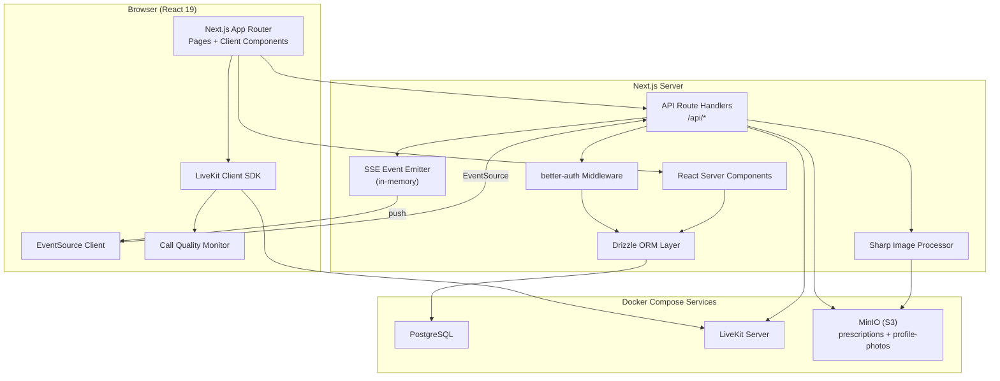
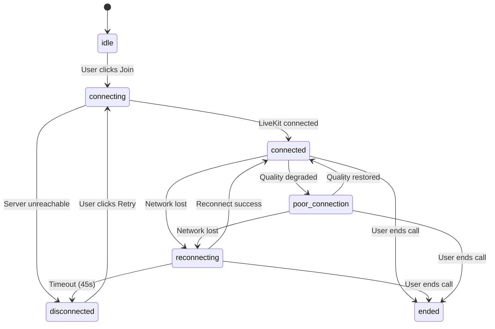
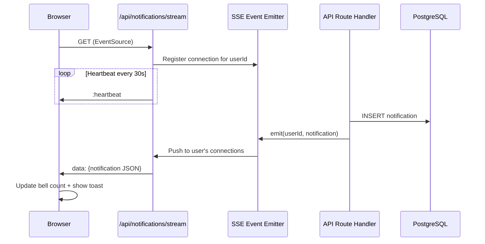

# Design Document: Platform Enhancements V2

## Overview

Platform Enhancements V2 extends the MediConnect Virtual Clinic across four major areas:

1. **Video Consultation Enhancements** — A connection state machine with five states (connecting, connected, poor_connection, reconnecting, disconnected), exponential backoff reconnection logic, and a call quality monitor using LiveKit's `ConnectionQuality` events. This replaces the existing basic reconnection timeout in `components/consultation/video-room.tsx`.

2. **Real-Time Notifications via SSE** — A Server-Sent Events endpoint (`/api/notifications/stream`) replaces the current 30-second polling in `components/layout/notification-bell.tsx`. An in-memory event emitter on the server pushes notifications to connected clients. Fallback to 15-second polling when SSE is unavailable.

3. **Admin Availability Management with Cascade Deletion** — Admins can view, filter, and bulk-delete doctor availability slots. Deleting a booked slot triggers a cascade: cancel the appointment, notify patient and doctor, and remove the slot — all in a single database transaction.

4. **User Profiles and Photo Upload** — New `doctor_profiles` and `patient_profiles` tables store extended profile data. A `notification_preferences` table stores per-user notification type toggles. Profile photos are resized via `sharp` and stored in MinIO in a new `profile-photos` bucket. Doctor profile cards appear in the booking flow.

All changes follow existing patterns: Next.js 14 App Router API route handlers, Drizzle ORM with PostgreSQL (timestamptz columns, text user IDs), shadcn/ui components, Zod validation, and the established error response format.

## Architecture

### High-Level Architecture Diagram (Updated)



### Video Connection State Machine



### SSE Notification Flow



### New Directory Structure (additions only)

```
app/
├── (dashboard)/
│   ├── admin/
│   │   └── availability/page.tsx          # Admin availability management
│   ├── settings/page.tsx                  # Profile settings page (all roles)
│   └── ...
├── api/
│   ├── notifications/
│   │   ├── route.ts                       # Existing (GET, PATCH)
│   │   ├── stream/route.ts               # SSE endpoint
│   │   ├── mark-all-read/route.ts        # Mark all as read
│   │   └── preferences/route.ts          # Notification preferences CRUD
│   ├── admin/
│   │   └── availability/route.ts          # Admin availability management
│   ├── profiles/
│   │   ├── doctor/route.ts               # Doctor profile CRUD
│   │   ├── patient/route.ts              # Patient profile CRUD
│   │   └── photo/route.ts               # Profile photo upload
│   └── ...
components/
├── consultation/
│   ├── video-room.tsx                     # Enhanced with state machine
│   ├── connection-state-indicator.tsx     # Connection state visual
│   ├── call-quality-monitor.tsx           # Quality indicators
│   └── reconnection-overlay.tsx           # Reconnection UI
├── admin/
│   └── availability-manager.tsx           # Admin slot management
├── profiles/
│   ├── doctor-profile-form.tsx            # Doctor profile editor
│   ├── patient-profile-form.tsx           # Patient profile editor
│   ├── photo-upload.tsx                   # Photo upload component
│   └── doctor-profile-card.tsx            # Doctor card in booking flow
├── layout/
│   └── notification-bell.tsx              # Enhanced with SSE
└── settings/
    └── notification-preferences.tsx       # Notification preferences UI
lib/
├── sse.ts                                 # SSE event emitter singleton
├── profile-photo.ts                       # Photo resize + MinIO upload
└── validators.ts                          # Extended with new schemas
```

## Components and Interfaces

### 1. Video Connection State Manager

Enhances the existing `VideoRoom` component with a proper state machine. The current implementation has a simple `RoomState` type with 5 states; this extends it to 6 states and adds the `poor_connection` state.

```typescript
// Types for the enhanced video room
type ConnectionState = 
  | "idle" 
  | "connecting" 
  | "connected" 
  | "poor_connection" 
  | "reconnecting" 
  | "disconnected" 
  | "ended";

interface ConnectionStateInfo {
  state: ConnectionState;
  quality?: "good" | "fair" | "poor";  // from LiveKit ConnectionQuality
  reconnectAttempts?: number;
  disconnectedAt?: Date;
}

// State transition function (pure, testable)
function transitionState(
  current: ConnectionState,
  event: ConnectionEvent
): ConnectionState | null;

type ConnectionEvent =
  | { type: "JOIN_CLICKED" }
  | { type: "CONNECTED" }
  | { type: "QUALITY_CHANGED"; quality: "good" | "fair" | "poor" }
  | { type: "DISCONNECTED" }
  | { type: "RECONNECT_SUCCESS" }
  | { type: "RECONNECT_TIMEOUT" }
  | { type: "RETRY_CLICKED" }
  | { type: "END_CALL" };
```

### 2. Reconnection Handler

Replaces the existing 30-second timeout with exponential backoff (1s → 2s → 4s → 8s → 10s cap) over a 45-second window.

```typescript
interface ReconnectionConfig {
  initialDelayMs: number;   // 1000
  maxDelayMs: number;       // 10000
  timeoutMs: number;        // 45000
  backoffMultiplier: number; // 2
}

// Pure function to compute next delay (testable)
function computeNextDelay(
  attempt: number,
  config: ReconnectionConfig
): number {
  return Math.min(
    config.initialDelayMs * Math.pow(config.backoffMultiplier, attempt),
    config.maxDelayMs
  );
}
```

### 3. Call Quality Monitor

Uses LiveKit's `RoomEvent.ConnectionQualityChanged` to display signal strength for both local and remote participants.

```typescript
interface ParticipantQuality {
  participantId: string;
  participantName: string;
  connectionQuality: "good" | "fair" | "poor" | "unknown";
  audioMuted: boolean;
  videoMuted: boolean;
}

// Component: CallQualityMonitor
// Props: none (reads from LiveKit room context)
// Renders: signal strength icons + mute indicators for local and remote
```

### 4. SSE Event Emitter (`lib/sse.ts`)

A singleton in-memory event emitter that maps user IDs to active `ReadableStreamController` instances. Supports multiple tabs per user.

```typescript
type SSEConnection = {
  controller: ReadableStreamDefaultController;
  createdAt: Date;
};

class SSEEventEmitter {
  private connections: Map<string, Set<SSEConnection>>;

  register(userId: string, controller: ReadableStreamDefaultController): void;
  unregister(userId: string, controller: ReadableStreamDefaultController): void;
  emit(userId: string, data: object): void;
  getConnectionCount(userId: string): number;
}

// Singleton export
export const sseEmitter = new SSEEventEmitter();
```

### 5. SSE Stream Endpoint (`/api/notifications/stream`)

```typescript
// GET /api/notifications/stream
// Returns: ReadableStream with SSE format
// Headers: Content-Type: text/event-stream, Cache-Control: no-cache
// Auth: requires valid session
// Heartbeat: sends `:heartbeat\n\n` every 30 seconds
```

### 6. Admin Availability Manager

```typescript
// GET /api/admin/availability?doctorName=X&dateFrom=Y&dateTo=Z&page=N&limit=M
// Returns: { slots: AvailabilitySlotWithDetails[], total, page, limit }

// DELETE /api/admin/availability
// Body: { slotIds: string[] }
// Cascade: for each booked slot, cancel appointment + notify users
// All in a single transaction; rolls back on failure
```

### 7. Profile API Routes

```typescript
// GET /api/profiles/doctor — get current doctor's profile
// PUT /api/profiles/doctor — upsert doctor profile
// GET /api/profiles/patient — get current patient's profile
// PUT /api/profiles/patient — upsert patient profile
// POST /api/profiles/photo — upload profile photo (multipart/form-data)
// GET /api/profiles/photo/[userId] — get pre-signed URL for user's photo

// GET /api/notifications/preferences — get user's notification preferences
// PUT /api/notifications/preferences — update notification preferences
// POST /api/notifications/mark-all-read — mark all notifications as read
```

### 8. Profile Photo Upload Flow (`lib/profile-photo.ts`)

```typescript
// Accepts: JPEG, PNG, WebP (max 5MB)
// Process: resize to 256x256 max dimension using sharp
// Storage: MinIO bucket "profile-photos", key: `{userId}.webp`
// On re-upload: delete old object first, then upload new
// Returns: MinIO object key stored in users.image column

const ALLOWED_TYPES = ["image/jpeg", "image/png", "image/webp"];
const MAX_FILE_SIZE = 5 * 1024 * 1024; // 5MB
const MAX_DIMENSION = 256;
const PHOTO_BUCKET = "profile-photos";

async function processAndUploadPhoto(
  userId: string,
  file: File
): Promise<string>;
```

### 9. Enhanced Notification Bell

The existing `NotificationBell` component is updated to:
1. Establish an `EventSource` connection to `/api/notifications/stream` on mount
2. Fall back to 15-second polling if SSE fails
3. Play an audio notification sound for important notification types
4. Show a toast alert via shadcn/ui `Sonner` for important notifications
5. Update unread count in real-time without page refresh

### 10. Doctor Profile Cards in Booking Flow

The existing `BookingStepper` component's Step 1 (Select Doctor) is enhanced to show profile cards with photo, specialization, years of experience, and consultation fee. Step 2 shows the full doctor profile alongside slot selection.

### 11. Notification Preferences

```typescript
// Default: all notification types enabled
const NOTIFICATION_TYPES = [
  "appointment_booked",
  "appointment_confirmed", 
  "appointment_rejected",
  "appointment_cancelled",
  "patient_calling",
  "prescription_ready",
] as const;

// Before creating a notification, check user's preferences
// If the type is disabled, skip creating the in-app notification
```

## Data Models

### Updated Entity Relationship Diagram

```mermaid
erDiagram
    USER ||--o| DOCTOR_PROFILE : "has (if doctor)"
    USER ||--o| PATIENT_PROFILE : "has (if patient)"
    USER ||--o{ NOTIFICATION_PREFERENCE : "configures"
    USER ||--o{ APPOINTMENT : "books (patient)"
    USER ||--o{ APPOINTMENT : "receives (doctor)"
    USER ||--o{ AVAILABILITY_SLOT : "creates"
    USER ||--o{ NOTIFICATION : "receives"
    APPOINTMENT ||--o| VISIT_NOTE : "has"
    APPOINTMENT ||--o| PRESCRIPTION : "has"
    AVAILABILITY_SLOT ||--o| APPOINTMENT : "booked by"

    DOCTOR_PROFILE {
        uuid id PK
        text userId FK UK
        varchar specialization
        text qualifications
        text bio
        varchar phone
        numeric consultationFee
        integer yearsOfExperience
        timestamptz createdAt
        timestamptz updatedAt
    }

    PATIENT_PROFILE {
        uuid id PK
        text userId FK UK
        date dateOfBirth
        varchar gender
        varchar phone
        text address
        varchar emergencyContactName
        varchar emergencyContactPhone
        varchar bloodType
        text allergies
        text medicalHistoryNotes
        timestamptz createdAt
        timestamptz updatedAt
    }

    NOTIFICATION_PREFERENCE {
        uuid id PK
        text userId FK
        varchar notificationType
        boolean enabled
        timestamptz createdAt
        timestamptz updatedAt
    }
```

### New Drizzle ORM Schema Definitions

```typescript
// Additions to lib/db/schema.ts

export const genderEnum = pgEnum("gender", ["male", "female", "other", "prefer_not_to_say"]);

export const bloodTypeEnum = pgEnum("blood_type", [
  "A+", "A-", "B+", "B-", "AB+", "AB-", "O+", "O-"
]);

export const doctorProfiles = pgTable("doctor_profiles", {
  id: uuid("id").defaultRandom().primaryKey(),
  userId: text("user_id")
    .notNull()
    .references(() => users.id)
    .unique(),
  specialization: varchar("specialization", { length: 255 }),
  qualifications: text("qualifications"),
  bio: text("bio"),
  phone: varchar("phone", { length: 20 }),
  consultationFee: numeric("consultation_fee", { precision: 10, scale: 2 }),
  yearsOfExperience: integer("years_of_experience"),
  createdAt: timestamp("created_at", { withTimezone: true }).defaultNow().notNull(),
  updatedAt: timestamp("updated_at", { withTimezone: true }).defaultNow().notNull(),
});

export const patientProfiles = pgTable("patient_profiles", {
  id: uuid("id").defaultRandom().primaryKey(),
  userId: text("user_id")
    .notNull()
    .references(() => users.id)
    .unique(),
  dateOfBirth: date("date_of_birth"),
  gender: genderEnum("gender"),
  phone: varchar("phone", { length: 20 }),
  address: text("address"),
  emergencyContactName: varchar("emergency_contact_name", { length: 255 }),
  emergencyContactPhone: varchar("emergency_contact_phone", { length: 20 }),
  bloodType: bloodTypeEnum("blood_type"),
  allergies: text("allergies"),
  medicalHistoryNotes: text("medical_history_notes"),
  createdAt: timestamp("created_at", { withTimezone: true }).defaultNow().notNull(),
  updatedAt: timestamp("updated_at", { withTimezone: true }).defaultNow().notNull(),
});

export const notificationPreferences = pgTable("notification_preferences", {
  id: uuid("id").defaultRandom().primaryKey(),
  userId: text("user_id")
    .notNull()
    .references(() => users.id),
  notificationType: varchar("notification_type", { length: 50 }).notNull(),
  enabled: boolean("enabled").notNull().default(true),
  createdAt: timestamp("created_at", { withTimezone: true }).defaultNow().notNull(),
  updatedAt: timestamp("updated_at", { withTimezone: true }).defaultNow().notNull(),
});
```

### New Zod Validation Schemas

```typescript
// Additions to lib/validators.ts
import { z } from "zod";

export const updateDoctorProfileSchema = z.object({
  specialization: z.string().min(1, "Specialization is required").max(255),
  qualifications: z.string().max(2000).optional(),
  bio: z.string().max(2000).optional(),
  phone: z.string().regex(/^\+?[\d\s\-()]{7,20}$/, "Invalid phone number").optional(),
  consultationFee: z.number().min(0, "Fee cannot be negative"),
  yearsOfExperience: z.number().int().min(0, "Years cannot be negative"),
});

export const updatePatientProfileSchema = z.object({
  dateOfBirth: z.string().regex(/^\d{4}-\d{2}-\d{2}$/).refine((d) => {
    return new Date(d) < new Date();
  }, "Date of birth cannot be in the future").optional(),
  gender: z.enum(["male", "female", "other", "prefer_not_to_say"]).optional(),
  phone: z.string().regex(/^\+?[\d\s\-()]{7,20}$/, "Invalid phone number").optional(),
  address: z.string().max(500).optional(),
  emergencyContactName: z.string().max(255).optional(),
  emergencyContactPhone: z.string().regex(/^\+?[\d\s\-()]{7,20}$/, "Invalid phone number").optional(),
  bloodType: z.enum(["A+", "A-", "B+", "B-", "AB+", "AB-", "O+", "O-"]).optional(),
  allergies: z.string().max(2000).optional(),
  medicalHistoryNotes: z.string().max(5000).optional(),
});

export const updateNotificationPreferencesSchema = z.object({
  preferences: z.array(z.object({
    notificationType: z.string().min(1),
    enabled: z.boolean(),
  })),
});
```


## Correctness Properties

*A property is a characteristic or behavior that should hold true across all valid executions of a system — essentially, a formal statement about what the system should do. Properties serve as the bridge between human-readable specifications and machine-verifiable correctness guarantees.*

### Property 1: Connection state machine transitions

The connection state manager uses a finite state machine with states: idle, connecting, connected, poor_connection, reconnecting, disconnected, ended. Each event should produce a deterministic, valid next state. Invalid transitions should be rejected (return null).

*For any* valid connection state and *for any* connection event, the `transitionState` function should return the correct next state according to the state machine diagram, and *for any* invalid state-event combination, it should return null. Specifically:
- idle + JOIN_CLICKED → connecting
- connecting + CONNECTED → connected
- connecting + DISCONNECTED → disconnected
- connected + QUALITY_CHANGED(poor) → poor_connection
- connected + DISCONNECTED → reconnecting
- connected + END_CALL → ended
- poor_connection + QUALITY_CHANGED(good|fair) → connected
- poor_connection + DISCONNECTED → reconnecting
- poor_connection + END_CALL → ended
- reconnecting + RECONNECT_SUCCESS → connected
- reconnecting + RECONNECT_TIMEOUT → disconnected
- reconnecting + END_CALL → ended
- disconnected + RETRY_CLICKED → connecting

**Validates: Requirements 1.1, 1.2, 1.3, 1.4, 1.5, 2.3, 2.4, 2.5, 2.6**

### Property 2: Exponential backoff delay computation

The reconnection handler computes delays using exponential backoff. The delay formula is `min(initialDelay * 2^attempt, maxDelay)`.

*For any* non-negative attempt number, `computeNextDelay(attempt, config)` should return a value equal to `min(1000 * 2^attempt, 10000)`, and the result should always be between `initialDelayMs` and `maxDelayMs` inclusive.

**Validates: Requirements 2.1**

### Property 3: Connection quality mapping

LiveKit provides connection quality as an enum (EXCELLENT, GOOD, POOR, UNKNOWN). The quality mapper converts these to display values.

*For any* LiveKit `ConnectionQuality` value, the `mapConnectionQuality` function should return one of "good", "fair", or "poor", and the mapping should be deterministic (same input always produces same output).

**Validates: Requirements 3.2, 3.3**

### Property 4: SSE fan-out delivery

The SSE event emitter maintains a map of user IDs to sets of active connections. When a notification is emitted for a user, it must be delivered to all of that user's active connections.

*For any* user ID with N registered SSE connections (where N ≥ 1), emitting a notification for that user should deliver the notification data to all N connections. Emitting a notification for a different user should not deliver to any of the first user's connections.

**Validates: Requirements 4.2, 4.5**

### Property 5: Notification creation on state-changing actions

When appointment status changes or a patient joins a video room, the notification service must create the correct notifications for the correct recipients.

*For any* state-changing action (booking, accepting, rejecting, cancelling, patient joining video room), the system should create the correct number of notifications with the correct type and recipient:
- Booking → 1 notification to doctor (appointment_booked)
- Accept → 1 notification to patient (appointment_confirmed)
- Reject → 1 notification to patient (appointment_rejected)
- Cancel → 2 notifications (patient + doctor, appointment_cancelled)
- Patient joins → 1 notification to doctor (patient_calling)

**Validates: Requirements 5.1, 5.2, 5.3, 5.4**

### Property 6: Mark all notifications as read

*For any* user with N unread notifications (N ≥ 0), executing the "mark all as read" operation should result in all of that user's notifications having `read = true`, and should not affect notifications belonging to other users.

**Validates: Requirements 6.1**

### Property 7: Notification preference filtering

*For any* user who has disabled a specific notification type in their preferences, and *for any* event that would normally create a notification of that type, the notification service should skip creating the in-app notification for that user.

**Validates: Requirements 6.3**

### Property 8: Default notification preferences

*For any* notification type and *for any* user who has not explicitly set a preference for that type, the system should treat the preference as enabled (default true).

**Validates: Requirements 6.4**

### Property 9: Admin availability slot filtering

*For any* set of availability slots and *for any* filter criteria (doctor name substring, date range), the admin availability API should return only slots where the doctor's name contains the substring AND the slot date falls within the specified date range. The result set should be complete (no matching slots omitted).

**Validates: Requirements 7.2**

### Property 10: Admin bulk slot deletion with cascade

*For any* set of selected availability slots (some booked, some unbooked), bulk deletion should: remove all selected slots, cancel all associated appointments (setting status to "cancelled"), and create exactly 2 notifications per cancelled appointment (one for patient, one for doctor with type "appointment_cancelled"). After deletion, none of the selected slots should exist, and all previously associated appointments should have status "cancelled".

**Validates: Requirements 7.4, 7.6, 8.1, 8.2, 8.3, 8.4, 8.5**

### Property 11: Profile save/retrieve round-trip

*For any* valid doctor profile data (specialization, qualifications, bio, phone, consultation fee, years of experience), saving the profile and then retrieving it should return data identical to what was saved. The same property holds *for any* valid patient profile data (date of birth, gender, phone, address, emergency contact, blood type, allergies, medical history notes).

**Validates: Requirements 9.3, 10.3**

### Property 12: Profile validation rejection

*For any* doctor profile with a negative consultation fee or negative years of experience or empty specialization, the validation schema should reject the input. *For any* patient profile with a future date of birth or a phone number that doesn't match the phone format regex, the validation schema should reject the input.

**Validates: Requirements 9.4, 10.4**

### Property 13: Photo upload lifecycle

*For any* valid image file (JPEG, PNG, or WebP, ≤ 5MB) with arbitrary dimensions, the photo processing pipeline should produce an output image with both width and height ≤ 256 pixels. *For any* user who already has a stored photo, uploading a new photo should result in exactly one photo in storage (the old one deleted, the new one present).

**Validates: Requirements 11.2, 11.3, 11.5**

### Property 14: Photo upload file validation

*For any* file with a MIME type not in {image/jpeg, image/png, image/webp}, the upload should be rejected. *For any* file with size > 5MB, the upload should be rejected. *For any* file with a valid MIME type and size ≤ 5MB, the upload should be accepted.

**Validates: Requirements 11.1**

### Property 15: Doctor list API includes profile data

*For any* doctor who has a completed profile, the doctor list API response should include the doctor's specialization, years of experience, and consultation fee alongside their name. *For any* doctor without a profile, the response should include the doctor's name and indicate the profile is incomplete.

**Validates: Requirements 13.1, 13.2**

### Property 16: Profile uniqueness constraint

*For any* user, attempting to create a second doctor profile or a second patient profile for the same user ID should be rejected, preserving the existing profile unchanged.

**Validates: Requirements 14.4, 14.5**

## Error Handling

### Video Consultation Errors (Enhanced)

| Scenario | HTTP Status | Response / Action |
|----------|-------------|-------------------|
| LiveKit server unreachable on initial connect | N/A (client) | State → disconnected, show "Video service unavailable" + Retry button |
| Network disconnection during session | N/A (client) | State → reconnecting, exponential backoff (1s–10s), 45s timeout |
| Reconnection timeout exceeded | N/A (client) | State → disconnected, show "Connection lost" + Retry button |
| Degraded network quality | N/A (client) | State → poor_connection, show quality warning banner |
| Token refresh on retry fails | 500 | `{ error: "Unable to create video session" }` — show error + Retry |

### SSE Errors

| Scenario | HTTP Status | Response / Action |
|----------|-------------|-------------------|
| Unauthenticated SSE request | 401 | `{ error: "Unauthorized" }` — no stream established |
| SSE connection dropped | N/A (client) | Browser EventSource auto-reconnects; fallback to 15s polling after 3 failures |
| Server restart (all connections lost) | N/A | Clients reconnect via EventSource; emitter re-registers connections |

### Admin Availability Errors

| Scenario | HTTP Status | Response / Action |
|----------|-------------|-------------------|
| Slot not found | 404 | `{ error: "Slot not found" }` |
| Cascade transaction failure | 500 | `{ error: "Failed to delete slots. All changes have been rolled back." }` |
| Unauthorized (non-admin) | 403 | `{ error: "Unauthorized" }` |
| Empty slot IDs array | 400 | `{ error: "Validation failed", details: [{ field: "slotIds", message: "At least one slot ID is required" }] }` |

### Profile Errors

| Scenario | HTTP Status | Response / Action |
|----------|-------------|-------------------|
| Invalid doctor profile data | 400 | `{ error: "Validation failed", details: [...] }` — field-level errors |
| Invalid patient profile data | 400 | `{ error: "Validation failed", details: [...] }` — field-level errors |
| Profile not found (GET) | 200 | Return `null` profile (not an error — profile not yet created) |
| Duplicate profile creation | 409 | `{ error: "Profile already exists" }` |

### Photo Upload Errors

| Scenario | HTTP Status | Response / Action |
|----------|-------------|-------------------|
| Invalid file type | 400 | `{ error: "Invalid file type. Accepted: JPEG, PNG, WebP" }` |
| File too large (> 5MB) | 400 | `{ error: "File size exceeds 5MB limit" }` |
| MinIO unavailable | 503 | `{ error: "Photo upload is temporarily unavailable" }` |
| Image processing failure | 500 | `{ error: "Failed to process image" }` |

### Notification Preference Errors

| Scenario | HTTP Status | Response / Action |
|----------|-------------|-------------------|
| Invalid notification type | 400 | `{ error: "Validation failed", details: [...] }` |
| Unauthorized | 401 | `{ error: "Unauthorized" }` |

## Testing Strategy

### Dual Testing Approach

This feature uses both unit tests and property-based tests for comprehensive coverage:

- **Unit tests**: Verify specific examples, edge cases, integration points, and error conditions
- **Property-based tests**: Verify universal properties across randomly generated inputs using `fast-check`

### Property-Based Testing Configuration

- **Library**: `fast-check` (already in devDependencies)
- **Test runner**: `vitest` with `--run` flag for single execution
- **Minimum iterations**: 100 per property test (most will use 200–500)
- **Each property test must reference its design document property** using the tag format:
  `Feature: platform-enhancements-v2, Property {number}: {property_text}`
- **Each correctness property must be implemented by a single property-based test**

### Test File Organization

```
__tests__/
├── properties/
│   ├── video-state-machine.property.test.ts    # Properties 1, 2, 3
│   ├── sse-emitter.property.test.ts            # Property 4
│   ├── notifications-v2.property.test.ts       # Properties 5, 6, 7, 8
│   ├── admin-availability.property.test.ts     # Properties 9, 10
│   ├── profiles.property.test.ts               # Properties 11, 12, 15, 16
│   └── photo-upload.property.test.ts           # Properties 13, 14
├── unit/
│   ├── video-room.test.ts                      # Connection state edge cases
│   ├── sse.test.ts                             # SSE endpoint integration
│   ├── profile-validators.test.ts              # Validation schema edge cases
│   └── photo-processing.test.ts                # Image resize edge cases
```

### Property Test Implementation Pattern

Following the existing codebase pattern (in-memory stores simulating database behavior):

```typescript
// Example: Each property test file follows this structure
// Feature: platform-enhancements-v2, Property N: Title
// **Validates: Requirements X.Y**

import { describe, it, expect } from "vitest";
import * as fc from "fast-check";

describe("Property N: Title", () => {
  it("property description", () => {
    fc.assert(
      fc.property(
        /* generators */,
        (/* generated values */) => {
          // Setup in-memory store
          // Execute operation
          // Assert property holds
        }
      ),
      { numRuns: 200 }
    );
  });
});
```

### Unit Test Focus Areas

Unit tests complement property tests by covering:

1. **Video room**: Specific state transition sequences (e.g., idle → connecting → connected → poor_connection → reconnecting → connected), boundary conditions at exactly 45 seconds
2. **SSE**: Connection lifecycle (register, heartbeat, unregister), error handling when controller is closed
3. **Cascade deletion**: Transaction rollback on failure, empty slot list edge case
4. **Profile validation**: Boundary values (fee = 0, years = 0, phone with country code), specific invalid inputs
5. **Photo upload**: 0-byte file, exactly 5MB file, non-image file with image extension
6. **Notification preferences**: All types disabled, preference update idempotency
